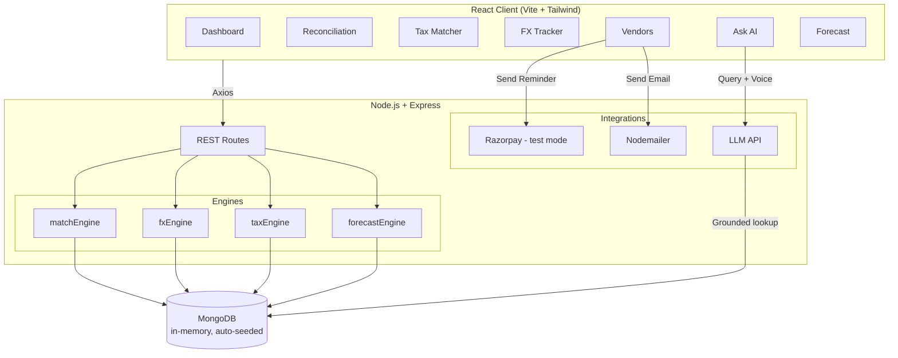

# ToTally 

*The reconciliation tool that doesn't just tell you the numbers don't match — it tells you why, in the language you actually speak.*


---

##   start here (2 minutes, zero setup)

You don't need to touch a database or hunt for API keys to see this working. Straight up:

1. **Clone it**
   ```bash
   git clone https://github.com/vardaagachake/ToTally.git
   cd ToTally
   ```
2. **Install both halves**
   ```bash
   cd server && npm install
   cd ../client && npm install
   ```
3. **Start the backend** (this spins up an in-memory MongoDB and seeds it automatically — 300+ realistic mock records, no config needed)
   ```bash
   cd server && node index.js
   ```
4. **Start the frontend** (new terminal)
   ```bash
   cd client && npm run dev
   ```
5. Open **`http://localhost:5173`** → click **"Seed & Run"** on the Dashboard → everything populates live.

That's it. No `.env` juggling required to see the app *work* — the Razorpay/LLM keys in `.env.example` only matter if you want the live payment link + AI Q&A calls to hit real APIs instead of their fallback demo behavior.

**Suggested 3-minute tour once it's open:** Dashboard → Reconciliation (click an exception, watch it explain itself) → FX Tracker (switch currencies in the dropdown) → Vendors (hit "Send Reminder," watch the QR pop up) → Ask AI (type or speak "ye 200 rupay ka hisab nahi mil raha").

---

## The problem

Every small business owner ends up doing the same tragic ritual at some point: bank statement in one tab, ledger in another, Razorpay settlement report in a third, trying to figure out why ₹200 has quietly vanished. Most "automated reconciliation" tools just slap a red flag on the mismatch and leave you to solve the actual mystery yourself. Cool, thanks, very helpful.

ToTally is what happens if you make the tool do the detective work instead of you.

## What it actually does

- **3-way reconciliation** — matches Bank, Ledger, and Razorpay Settlement data, with a confidence label per transaction (exact / fuzzy / duplicate / currency mismatch), and it double-checks its own confident matches instead of blindly trusting itself.
- **FX Tracker** — multi-currency drift tracking (USD, EUR, GBP, AED, SGD) that actually compares rates on the right dates, so it can tell "explained by exchange rate" apart from "no, something's actually wrong here."
- **Tax Matcher** — classifies GST slabs and shows you *which rule fired and why*, instead of a mystery black box. Ambiguous ones get queued for you to resolve manually.
- **Vendor Alerts** — catches vendors quietly billing 4x their usual amount, tracks who's overdue against their promised terms, and can fire off a reminder email with a real Razorpay payment link + QR code — but always asks you first.
- **Ask AI** — a chat + voice assistant grounded in your actual data (it shows its receipts, literally — source rows included). Talks back in English, Hindi, or Hinglish, because "please refer to invoice reference number" is not how anyone actually talks about money.
- **Cash Forecaster** — projects your cash position with what-if scenarios, and widens its confidence band the more unresolved exceptions are sitting in the queue, instead of pretending it can see the future with perfect clarity.
- **Zero-setup demo mode** — in-memory MongoDB, auto-seeded, no external DB required. Built specifically so a judge doesn't have to debug our infra to see our product.

## Architecture



Client talks to Express over REST. Every page hits its own engine, every engine hits Mongo. Vendor reminders are the one flow that reaches out to the outside world — Razorpay for the payment link/QR, Nodemailer for the actual email — and only after you hit "Approve" in the popup.

## Tech stack

| Layer | Choice |
|---|---|
| Frontend | React (Vite), Tailwind CSS, Recharts, `qrcode.react`, Web Speech API |
| Backend | Node.js, Express |
| Database | MongoDB via Mongoose, `mongodb-memory-server` for zero-setup demo |
| Payments | Razorpay (test mode — Settlements & Payment Links APIs) |
| Email | Nodemailer |
| AI | LLM API (Claude / OpenAI / Gemini — swappable) for reasoning, exception explanations, and Ask AI |

## Project structure

```
ToTally/
├── client/                 React frontend
│   └── src/
│       ├── api/               Axios config + endpoint calls
│       ├── components/        Sidebar, Topbar, shared UI
│       └── pages/             Dashboard, FX Tracker, Ask AI, Vendors, etc.
├── server/                 Node/Express backend
│   ├── engines/               matchEngine, fxEngine, taxEngine, forecastEngine
│   ├── integrations/          razorpay.js, mailer.js, ai.js
│   ├── models/                Mongoose schemas
│   ├── routes/                Express routes
│   └── seed/                  Mock data generation
├── .env.example
└── README.md
```

## Full local setup (with real API keys)

If you want the live Razorpay calls and real LLM-powered Ask AI instead of demo fallbacks, drop a `.env` in `/server`:

```env
PORT=5000
RAZORPAY_KEY_ID=rzp_test_...
RAZORPAY_KEY_SECRET=...
# pick one
GEMINI_API_KEY=
OPENAI_API_KEY=
CLAUDE_API_KEY=
```

Then follow the same install + run steps as the judge quick-start above. Backend on `http://localhost:5000`, frontend on `http://localhost:5173`.


